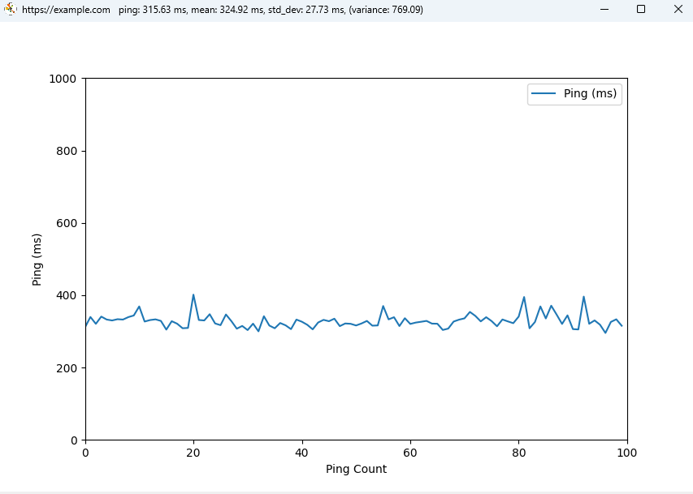

# Internet Statistics

This project is a Python-based tool for monitoring and analyzing the response times of a website. It consists of three main scripts that work together to measure response times, calculate statistical metrics, and display the results in real-time.

## Features

- **Ping a website**: Measure the response time of a given URL.
- **Statistical analysis**: Calculate the mean, variance, and standard deviation of the response times.
- **Real-time updates**: Continuously display the latest statistics in the console.

## Project Structure

- `main.py`: The main script that orchestrates the interaction between the other scripts.
- `subproc_ping.py`: A subprocess that pings the given URL and outputs the response time.
- `subproc_calc.py`: A subprocess that calculates statistical metrics based on the response times received from `subproc_ping.py`.

## How It Works

1. `main.py` starts two subprocesses:
   - `subproc_ping.py` to measure response times.
   - `subproc_calc.py` to calculate statistics.
2. The response times from `subproc_ping.py` are piped into `subproc_calc.py`.
3. `subproc_calc.py` computes the mean, variance, and standard deviation of the response times and sends the results back to `main.py`.
4. `main.py` displays the results in real-time.

## Prerequisites

- Python 3.6 or higher
- `requests` library (install using `pip install requests`)
- `matplotlib` library (install using `pip install matplotlib`)

## Installation

1. Clone this repository:
   ```bash
   git clone https://github.com/KeepeuhCalmeuh/Internet-stat.git
   ```
2. Navigate to the project directory:
   ```bash
   cd internet-stat
   ```
3. Install the required dependencies:
   ```bash
   pip install -r requirements.txt
   ```

## Usage

1. Run the main script:
   ```bash
   python main.py
   ```
2. By default, the script pings `https://github.com`. To specify a different URL, pass it as an argument:
   ```bash
   python main.py https://example.com
   ```
3. To enable graph mode, add the argument `graph=true`:
   ```bash
   python main.py https://example.com graph=true
   ```
4. To enable export mode, add the argument `export=true`:
   ```bash
   python main.py https://example.com export=true
   ```
5. Press `Ctrl+C` to stop the script.

## Example Output

```
The URL https://example.com will be used.
Using address: https://example.com
Graph mode: enabled
Export mode: enabled
ping:  https://example.com
ping: 374.63 ms, mean: 374.63 ms, std_dev: 0.00 ms, (variance: 0.00)
ping: 303.29 ms, mean: 338.96 ms, std_dev: 50.45 ms, (variance: 2544.91)
ping: 314.05 ms, mean: 330.66 ms, std_dev: 38.46 ms, (variance: 1479.23)
ping: 321.06 ms, mean: 328.26 ms, std_dev: 31.77 ms, (variance: 1009.17)
ping: 319.06 ms, mean: 326.42 ms, std_dev: 27.82 ms, (variance: 773.82)
ping: 323.73 ms, mean: 325.97 ms, std_dev: 24.91 ms, (variance: 620.26)
ping: 365.86 ms, mean: 331.67 ms, std_dev: 27.28 ms, (variance: 744.19)
```


## Notes

- The `subproc_calc.py` script maintains a sliding window of the last 10 response times for statistical calculations.
- Negative response times indicate errors:
  - `-1`: not good response.status_code.
  - `-2`: unreachable.

## License

This project is licensed under the MIT License. See the [LICENSE](LICENSE) file for details.
